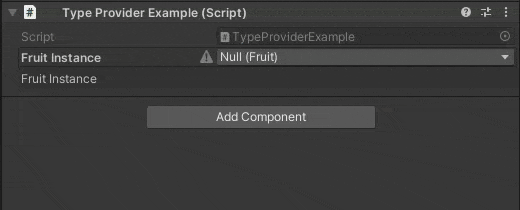

# SerializeReference Dropdown
### `[ReferenceDropdown]`
Decorates a [`[SerializeReference]`](https://docs.unity3d.com/ScriptReference/SerializeReference.html) field, adding a type selection dropdown and other optional features.  

| Argument                | Description                                                                                                                                                           |
|-------------------------|-----------------------------------------------------------------------------------------------------------------------------------------------------------------------|
| **type** (optional)     | Type constraint                                                                                                                                                       |
| **features** (optional) | Feature selection flags:<br/>- Remove the constrained type label (Type)<br/>- Remove "Set to null" from the context menu<br/>- Hide the warning icon for null entries |

```csharp
[SerializeReference, ReferenceDropdown]
public Fruit[] FruitInstance;
```
  


`ReferenceDropdown` supports **property drawers**, **decorators**, and  **UIToolkit**.  
- IMGUI support (optional) uses IL injection to make multiple modifications to the editor DLL.  
- UIToolkit support uses stateful DecoratorDrawer hacks.  

Other implementations often don't support property drawers due to this complexity.


### Customising names
You can inherit from `AdvancedDropdownAttribute`, and pass the type to ReferenceDropdown. When implemented on your target types it allows you to define custom names and paths for types.

## Installation

> **Warning**  
> **This package requires Unity 2020.3+**  
> In versions **below 2021** `ReferenceDropdown` may draw incorrectly when used with property drawers that nest property fields.
> 
> UIToolkit support may have some issues responding to changes, especially involving Undo.  
> If you have a problem, feel free to create an issue ticket, but pull requests are preferred as this is just a painfully buggy and unsupported area of Unity.

[](https://openupm.com/packages/com.vertx.serializereference-dropdown/)

<table><tr><td>

#### Add the OpenUPM registry
1. Open `Edit/Project Settings/Package Manager`
1. Add a new Scoped Registry (or edit the existing OpenUPM entry):
   ```
   Name: OpenUPM
   URL:  https://package.openupm.com/
   Scope(s): com.vertx
             com.needle
   ```
1. **Save**

#### Add the package
1. Open the Package Manager via `Window/Package Manager`.
1. Select the <kbd>+</kbd> from the top left of the window.
1. Select **Add package by Name** or **Add package from Git URL**.
1. Enter `com.vertx.serializereference-dropdown`.
1. Select **Add**.

#### Optionally add IMGUI support
Add `com.needle.editorpatching`. The `com.needle` scope is only required to support IMGUI.  
The implementation relies on patching the editor DLL so avoid adding it if it's not required. 

</td></tr></table>

[](https://ko-fi.com/Z8Z42ZYHB)